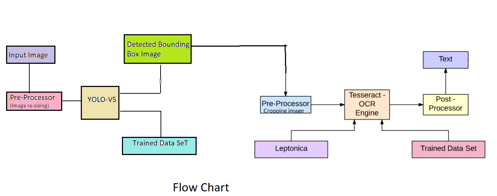
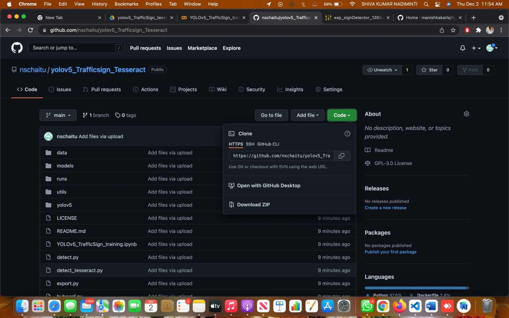
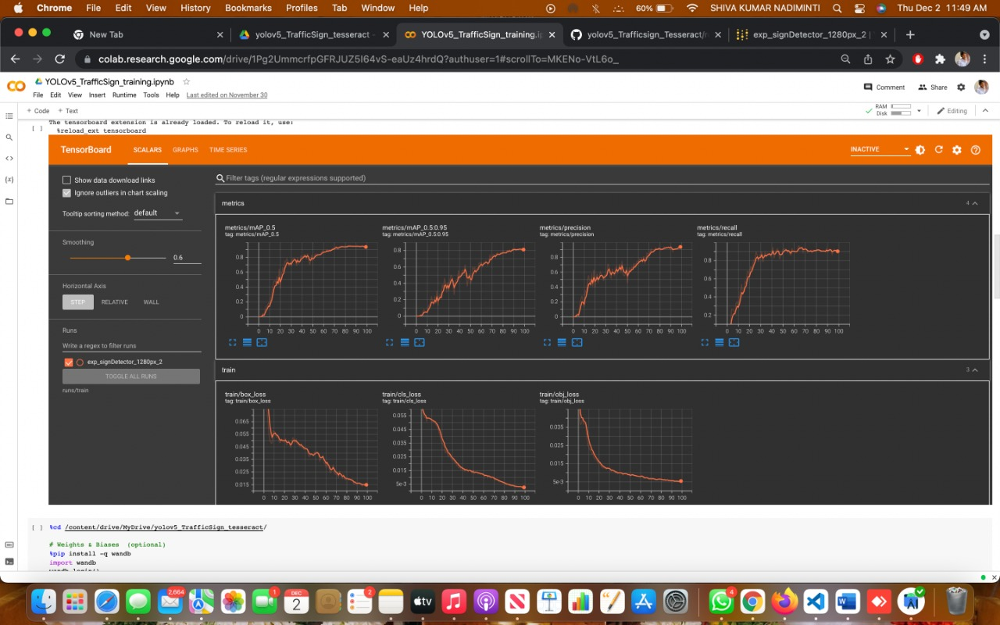
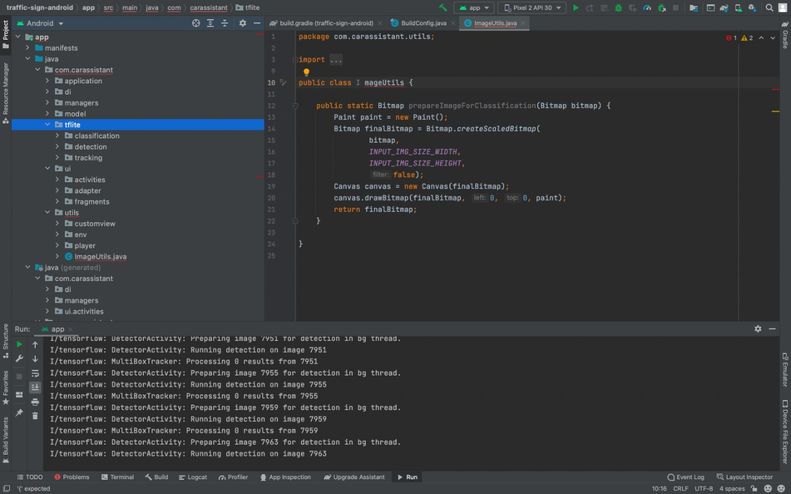

# Project 3 - Detection of Traffic sign using Computer vision

## Group-6

```
Sri Sowmya Chikkam          oq4349 		schikkam@horizon.csueastbay.edu
Sai Chaitanya Nadendla 	    zy6108 		snadendla3@horizon.csueastbay.edu
Shiva Kumar Nadiminti 	     fo6369 		snadiminti@horizon.csueastbay.edu
Jagathi Medempudi		         tv1499 		jmedempudi@horizon.csueastbay.edu
```

## ABSTRACT

Road Traffic Sign Detection consists of two primary tasks, detection (finding the location and size of the object on the input image), and classification (classifying the detected objects into subclasses). Both tasks are usually done with a single detection/classification model such as YOLO and Tesseract where input images are labelled with the bounding boxes and respective classes. However, labelling and training such datasets requires a lot of time and effort. We will take Traffic sign image Dataset as a train and test Data for Input. 

 

## Section 1 Execution Instructions: 
```
First unzip yolov5_TrafficSign_tesseract,zip file, 

Then change directory 
> cd yolov5_TrafficSign_tesseract

Install dependency
> pip install -r requirements.txt

Training
follow this jupyter notebook: YOLOv5_TrafficSign_training.ipynb 

After successfully completing training, copy weight file from runs/train/{exp_name}/weights/best.pt to saved_weights

## inference
> python detect_tesseract.py --weights saved_weights/best.pt --img 1260 --use-tesseract --view-img --save-crop --source data/test_images/test1.png

For more info. check --help tag
> python detect_tesseract.py --help

Note: --source--source 0  # webcam
                          img.jpg  # image 
                          vid.mp4  # video
                          path/  # directory
                          path/*.jpg  # glob
                          'https://youtu.be/Zgi9g1ksQHc'  # YouTube
                          'rtsp://example.com/media.mp4'  # RTSP, RTMP, HTTP stream
We should download the source code from the GitHub repository (yolov5_Trafficsign_Tesseract) 
```


Below is the screenshot (Fig 1) of GitHub repository, we need to download.
 
Fig 1
 
Fig 2
Fig2 image shows ImageUtils.java class, it prepares images for Classification and it draws the image using the Canvas.
  

Fig 3
The figure 3 displays TFLiteObjectDetectionAPIModel.java file 
Section 2 Code Description
Step 1: Setup
Clone repo, install dependencies and check PyTorch and GPU.
 

Step 2 : Download Dataset
 

Step 3 : Train on Traffic Sign dataset
detect.py runs YOLOv5 inference on a variety of sources, downloading models automatically from the latest YOLOv5 release, and saving results to runs/detect. Example inference sources are:

# Train YOLOv5s on TrafficSign dataset for 300 epochs
! python train.py --img 1280 --batch 16 --epochs 100 --data data/gtsdb.yaml --weights yolov5s.pt --cache --noautoanchor --name exp_signDetector_1280px_2 


Step 4 : After training, we are logging the results in to the TensorBoard

 


Step 5 : Below command is for Detection of Traffic Sign without integration of Tesseract


 
The above is the command which takes the parameter weights, and those weights are training weights and image size is 1280, and we have specified the source location of the test image.

Step 6 : Below command is for Detection of Traffic Sign with integration of Tesseract

 

Section 3 Testing
Training Results: The below screenshot shows  metrics such as Precision, Recall, Accuracy, mAP, etc
 

The below screenshot shows Time series values of training data
 

section 3.1: Starting application
The below is the input image which is being passed as input.
 
                                                     Fig 3.1a
The below image shows detecting the STOP traffic sign with the accuracy of 87.89%

 
                                                          Fig 3.1b

